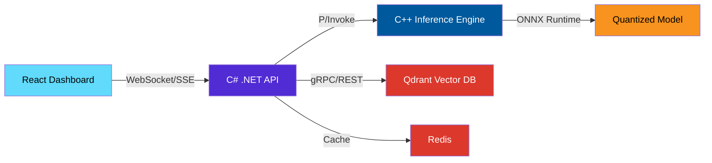
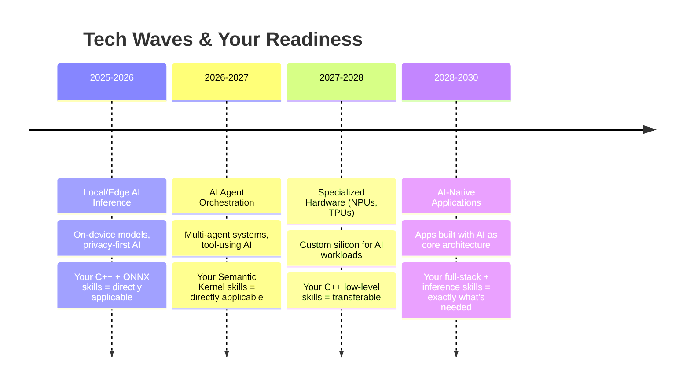

# 🚀 AI System Architect: 6-Month Accelerated Roadmap

## The Big Picture — Why This Path Exists

> [!IMPORTANT]
> The AI industry is splitting into two tiers: **prompt engineers** (replaceable, commoditized) and **system architects** (rare, highly paid, recession-resistant). This roadmap puts you firmly in the second tier.

Most developers today are learning *how to use* AI APIs. You're learning **how AI systems actually work under the hood** — from the C++ inference layer to the orchestration middleware to the streaming frontend. This is the difference between a taxi driver and an automotive engineer.

---

## 🧠 Why This Stack Saves Your Career

### The Irreplaceability Pyramid

```
                    ┌─────────────┐
                    │   C++ / ML  │  ← Hardest to replace, highest pay
                    │  Inference  │     ($180K-$350K+)
                    ├─────────────┤
                    │ Orchestration│  ← Growing demand, moderate supply
                    │  .NET / SK  │     ($140K-$220K)
                    ├─────────────┤
                    │  Full-Stack  │  ← Abundant supply, AI-threatened
                    │ React/Angular│     ($90K-$150K)
                    ├─────────────┤
                    │  Prompt Eng  │  ← Most replaceable
                    │  / No-Code  │     ($60K-$100K, declining)
                    └─────────────┘
```

### Why Each Layer Matters

| Layer | Why It Protects You | Future-Proof Score |
|-------|--------------------|--------------------|
| **C++ Inference** | AI can't optimize its own runtime. Someone must write the kernels, manage memory, quantize models. This is *hard*, and the talent pool is *tiny*. | ⭐⭐⭐⭐⭐ |
| **.NET + Semantic Kernel** | Enterprise AI adoption runs on .NET. Microsoft is betting heavily on SK as the orchestration standard. Enterprise = stable jobs. | ⭐⭐⭐⭐ |
| **RAG + Vector DBs** | Every company deploying AI needs retrieval pipelines. This is the "data plumbing" that makes AI actually useful with proprietary data. | ⭐⭐⭐⭐ |
| **React/Angular Streaming** | Someone must build the UI for AI products. Streaming, real-time updates, and WebSocket handling are non-trivial. | ⭐⭐⭐ |
| **Docker + DevOps** | AI systems are notoriously hard to deploy. Containerization skills are table stakes. | ⭐⭐⭐ |

> [!TIP]
> **The golden insight:** Companies don't hire "AI engineers." They hire engineers who can **build the full pipeline** — from model inference to user-facing product. You become the person who connects all the dots.

---

## 🗓️ The Compressed 6-Month Schedule

### Strategy for Compression
The original 12-month plan had generous time buffers. Here's how we compress without losing depth:
- **Months 1-3** merge the original Months 1-6 (Full-Stack AI + Infrastructure)
- **Months 4-6** merge the original Months 7-12 (C++ Performance + Capstone)
- **Overlap learning** — build projects that teach multiple skills simultaneously
- **Cut theory, maximize building** — learn by doing, not by watching

---

### 🟦 Phase 1: Weeks 1-4 — AI-Powered Full-Stack Foundation

**Goal:** Build a working AI-powered web app with streaming responses.

#### Week 1-2: Semantic Kernel + C# Backend
- [ ] Set up a C# .NET 8 Web API project
- [ ] Install and configure **Microsoft Semantic Kernel**
- [ ] Build a chat endpoint that streams responses via **Server-Sent Events (SSE)**
- [ ] Implement prompt templates and kernel function pipelines
- [ ] Add API key authentication (JWT or API key middleware)

#### Week 3-4: React/Angular Streaming Frontend
- [ ] Build a React (or Angular) chat UI with **streaming text rendering**
- [ ] Implement `EventSource` or `fetch` with `ReadableStream` for SSE consumption
- [ ] Add loading states, error handling, and retry logic
- [ ] Style with a production-quality design system (Shadcn, Material, or custom)

> **🏗️ Deliverable:** A full-stack AI chat app with streaming responses, auth, and a polished UI.

---

### 🟩 Phase 2: Weeks 5-8 — RAG, Vector DBs & Caching

**Goal:** Make your AI app smart with proprietary data retrieval.

#### Week 5-6: RAG Architecture
- [ ] Understand embedding models (text-embedding-ada-002, or open-source alternatives)
- [ ] Set up **Qdrant** or **pgvector** locally via Docker
- [ ] Build an ingestion pipeline: PDF/text → chunking → embedding → vector store
- [ ] Implement semantic search + context injection into your Semantic Kernel pipeline

#### Week 7-8: Caching & Cost Optimization
- [ ] Deploy **Redis** and implement semantic caching (cache by embedding similarity)
- [ ] Add request deduplication and rate limiting
- [ ] Measure and log: tokens used, latency, cache hit rates
- [ ] Study GPU vs. CPU execution — when does each make sense?

> **🏗️ Deliverable:** Your chat app now answers questions about uploaded documents using RAG, with Redis caching cutting API costs by ~40-60%.

---

### 🟨 Phase 3: Weeks 9-12 — C++ Inference & Native Interop

**Goal:** Run AI models locally in C++ and connect them to your .NET backend.

#### Week 9-10: C++ Model Inference
- [ ] Set up a C++20 project with CMake
- [ ] Load a pre-trained ONNX model using **ONNX Runtime C++ API**
- [ ] Write data preprocessing in C++ (tokenization, image normalization)
- [ ] Benchmark inference: measure latency, memory usage, throughput
- [ ] **Alternative path:** Use **LibTorch** if you prefer PyTorch ecosystem

#### Week 11-12: Native Interop & Quantization
- [ ] Build a C shared library (`.dll`/`.so`) exposing inference functions
- [ ] Connect to your C# backend via **P/Invoke** or **C++/CLI**
- [ ] Learn **model quantization** (INT8, FP16) using ONNX Runtime tools
- [ ] Measure the speed/accuracy tradeoff of quantized models
- [ ] Profile with tools like `perf`, `valgrind`, or Visual Studio Profiler

> **🏗️ Deliverable:** A C++ inference engine running quantized models, callable from your .NET API.

---

### 🟥 Phase 4: Weeks 13-20 — Capstone Project (8 Weeks)

**Goal:** Build a production-grade portfolio piece that proves you can architect the full stack.

#### Capstone: AI-Powered Document Intelligence Platform



#### Weeks 13-14: C++ Core Engine
- [ ] Choose a model task: **text classification**, **named entity recognition**, or **object detection**
- [ ] Build robust C++ inference with error handling, batching, and memory management
- [ ] Expose clean C API for interop
- [ ] Write unit tests for the C++ layer

#### Weeks 15-16: .NET Microservice Wrapper
- [ ] Build the C# API wrapping your C++ engine
- [ ] Integrate RAG pipeline for document retrieval
- [ ] Add semantic caching with Redis
- [ ] Implement health checks, structured logging (Serilog), and metrics

#### Weeks 17-18: React Dashboard
- [ ] Build a real-time dashboard showing:
  - Live AI inference results (streaming)
  - System latency graphs (Chart.js or Recharts)
  - Document upload and processing status
  - Cache hit/miss ratio visualization
- [ ] Implement WebSocket connections for live metrics

#### Weeks 19-20: DevOps & Documentation
- [ ] Write `Dockerfile` for each service (multi-stage builds for C++)
- [ ] Create `docker-compose.yml` orchestrating all services
- [ ] Write interactive API docs (Swagger/OpenAPI)
- [ ] Create a comprehensive README with architecture diagrams
- [ ] Record a demo video walkthrough

> **🏗️ Deliverable:** A fully containerized, multi-service AI platform with a polished dashboard, live metrics, and comprehensive documentation.

---

### 🟪 Weeks 21-24: Polish, Interview Prep & Job Hunt

- [ ] Write detailed blog posts / technical articles about your architecture decisions
- [ ] Prepare system design answers: "Design a scalable AI inference pipeline"
- [ ] Practice explaining your capstone: cost analysis, latency numbers, scaling strategies
- [ ] Contribute to open-source (ONNX Runtime, Semantic Kernel — even docs count)
- [ ] Build your LinkedIn presence around AI systems engineering

---

## 📊 Weekly Time Commitment

| Activity | Hours/Week | Notes |
|----------|-----------|-------|
| Focused coding & building | 15-20 hrs | Non-negotiable core |
| Reading docs, papers, tutorials | 3-5 hrs | Just-in-time learning |
| Reviewing & refactoring | 2-3 hrs | Code quality matters for portfolio |
| Writing (blog, docs, README) | 2-3 hrs | This is how you get noticed |
| **Total** | **22-31 hrs/week** | Sustainable if you have a day job |

> [!WARNING]
> **If you're working full-time**, stick to 20-25 hrs/week. Burnout kills more roadmaps than difficulty does. Consistency > intensity.

---

## 💼 Hiring Value — What Makes You Employable

### The Roles You'll Qualify For

| Role | Avg Salary (USD) | Your Advantage |
|------|------------------|----------------|
| **ML Infrastructure Engineer** | $160K-$280K | C++ inference + deployment pipeline |
| **AI Platform Engineer** | $150K-$250K | Full stack + orchestration + DevOps |
| **Senior Backend Engineer (AI)** | $140K-$220K | .NET + Semantic Kernel + RAG |
| **Edge ML Engineer** | $150K-$260K | C++ quantization + local inference |
| **Solutions Architect (AI)** | $160K-$240K | End-to-end system design knowledge |

### What Hiring Managers Actually Look For

> [!NOTE]
> I've distilled this from real job postings at Microsoft, Google, Meta, NVIDIA, and AI startups (2024-2026 trends):

1. **"Can you build it end-to-end?"** — Your capstone proves this
2. **"Can you make it fast?"** — C++ inference + quantization proves this
3. **"Can you make it cost-effective?"** — Semantic caching + cost analysis proves this
4. **"Can you explain the tradeoffs?"** — Your blog posts and system design answers prove this
5. **"Have you shipped something real?"** — Your Docker-containerized project proves this

### Your Resume Differentiators

Most candidates can say: *"I used OpenAI's API to build a chatbot."*

You can say:
- *"I built a C++ inference engine running quantized ONNX models at 3ms latency on consumer hardware"*
- *"I designed a RAG pipeline with semantic caching that reduced API costs by 55%"*
- *"I architected a full-stack AI platform with streaming responses, real-time metrics, and containerized deployment"*

**That's the difference between getting filtered out and getting an interview.**

---

## 🔮 Can You Survive and Adapt to Future Tech?

### The Honest Answer: **Yes, and here's exactly why.**

#### What AI *Will* Replace (2025-2030)
- ❌ Boilerplate CRUD development
- ❌ Simple API integrations
- ❌ Basic frontend component work
- ❌ Prompt engineering as a standalone job
- ❌ Manual testing and QA scripting

#### What AI *Cannot* Replace (and why you're safe)

| Skill | Why AI Can't Replace It |
|-------|------------------------|
| **C++ memory management & optimization** | AI generates buggy C++ with memory leaks. Humans must review, profile, and fix. |
| **System architecture decisions** | "Should we run inference on-device or in the cloud?" requires business context AI doesn't have. |
| **Cost-performance tradeoffs** | Choosing between FP16 and INT8 quantization requires domain-specific benchmarking. |
| **Debugging production ML pipelines** | When inference latency spikes at 3 AM, you need someone who understands the full stack. |
| **Cross-layer integration** | Connecting C++ engines to .NET services via P/Invoke is brittle work that requires deep systems knowledge. |

#### The Future Tech Waves You'll Be Ready For



> [!TIP]
> **The meta-skill you're building isn't any single technology — it's the ability to work across the full AI stack.** Technologies change. The ability to understand systems from silicon to screen does not.

---

## 🛡️ Survival Skills — Your Insurance Policy

### The Three Skills That Never Expire

1. **Cost Architecting**
   - Know how much each inference call costs
   - Calculate: *"At 10,000 requests/day, this model costs $X/month on GPU vs. $Y/month on CPU with quantization"*
   - This makes you invaluable to any company trying to make AI profitable

2. **Hybrid Deployment Thinking**
   - Cloud inference: high cost, easy scaling, latest models
   - Edge/local inference: zero marginal cost, privacy-compliant, limited model size
   - The engineer who can design **both** and knows **when to use which** is worth 2x

3. **Data Pipeline Intuition**
   - Raw input → preprocessing → embedding → retrieval → inference → post-processing → UI
   - Understanding this full pipeline means you can debug **anywhere** in the chain
   - Most engineers only understand 1-2 stages. You'll understand all of them.

---

## 📋 Month-by-Month Milestone Summary

| Month | Focus | Key Deliverable | Skills Gained |
|-------|-------|-----------------|---------------|
| **1** | Full-Stack AI App | Streaming chat app with auth | Semantic Kernel, SSE, React |
| **2** | RAG & Infrastructure | Document Q&A with caching | Vector DBs, Redis, embeddings |
| **3** | C++ Inference | ONNX model running in C++ | C++20, ONNX Runtime, profiling |
| **4** | Capstone Core | C++ engine + .NET API | P/Invoke, quantization, interop |
| **5** | Capstone UI + DevOps | Dashboard + Docker | Streaming UI, containerization |
| **6** | Polish + Job Hunt | Portfolio + interview prep | System design, communication |

---

## 🎯 Final Words

> [!CAUTION]
> **The biggest risk isn't that this roadmap is wrong. It's that you don't finish it.** 80% of developers abandon roadmaps by month 2. The ones who finish become the ones who get hired.

### Your Competitive Edge in One Sentence:

**"I don't just call AI APIs — I architect the systems that make AI work in production, from the C++ inference kernel to the streaming React dashboard."**

That sentence, backed by a real capstone project, real metrics, and real code on GitHub, will put you ahead of 95% of candidates in 2026-2027.

**Start today. Ship weekly. Document everything.**
